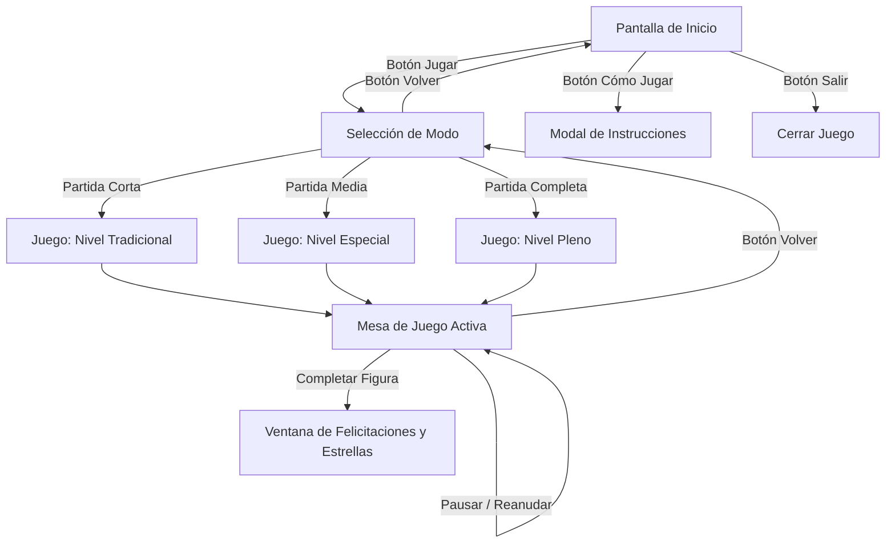

# Bingo Calma — Estimulación Cognitiva y Sensorial
## Documentación General y Manual del Sistema para el Cliente

---

### 1. Resumen Ejecutivo y Propósito

**Bingo Calma** es una plataforma digital de estimulación cognitiva interactiva concebida para adultos mayores y personas en programas de bienestar mental y memoria.

A diferencia de los bingos tradicionales basados en números abstractos o presiones de tiempo, Bingo Calma utiliza **elementos temáticos familiares** distribuidos en 5 categorías nostálgicas (Animales, Sabores, Objetos clásicos, Naturaleza y Tradiciones musicales). 

#### Objetivos del Sistema:
- **Estimular la memoria remota y el reconocimiento visual:** a través de iconos de alta definición y palabras evocadoras.
- **Favorecer la concentración sostenida:** mediante el seguimiento de balotas en dos cartones simultáneos.
- **Eliminar la ansiedad:** interfaz tranquila, sin límites de tiempo, con música relajante y retroalimentación positiva ante cada acierto.

---

### 2. Estructura del Software (Arquitectura Limpia)

El sistema ha sido desarrollado bajo un modelo modular de tres capas, garantizando orden, facilidad de mantenimiento y excelente rendimiento:

```
Proyecto BINGO/
│
├── main.py             # Capa de Interfaz y Experiencia de Usuario (GUI)
├── logica.py           # Motor de Reglas, Validación de Bingos y Puntuación
├── recursos.py         # Gestor Centralizado de Assets (Imágenes, Fuentes, Audio)
│
└── assets/             # Recursos Multimedia
    ├── BINGO/          # Spritesheets oficiales de iconos (B, I, N, G, O)
    ├── carton/         # Texturas de tableros y marcos de selección
    ├── fondo/          # Fondo relajante para la mesa de juego
    ├── musica/         # Pistas de audio ambiental (.ogg)
    ├── pantalla de inicio/     # Elementos gráficos del menú principal
    ├── pantalla de seleccion/  # Tarjetas de modalidades de partida
    └── rectangulos de formas/  # Indicadores visuales de las figuras ganadoras
```

#### Descripción de los Módulos:

1. **`main.py` (Presentación e Interacción):**
   - Controla las pantallas del juego: Inicio, Guía de Instrucciones, Selección de Modo y Mesa de Juego.
   - Gestiona eventos de teclado, ratón, efectos de iluminación (*hover*) y animaciones suaves.
   - Representa los tableros interactivos y muestra los textos adaptados en dos líneas para óptima lectura.

2. **`logica.py` (Cerebro del Juego):**
   - Administra el catálogo de los 75 elementos temáticos.
   - Genera cartones únicos y balanceados en cada partida nueva (matriz de 5x5 con casilla central libre).
   - Controla el bolillero digital (extracción sin repetición).
   - Valida automáticamente en tiempo real las 14 figuras ganadoras y calcula recompensas de enfoque.

3. **`recursos.py` (Gestión de Recursos Multimedia):**
   - Configura rutas absolutas y relativas seguras mediante `pathlib`.
   - Procesa los spritesheets de 3x5 de cada columna para extraer con precisión quirúrgica cada uno de los 75 iconos temáticos.
   - Aplica filtros rápidos con tecnología matricial (NumPy) para limpiar halos oscuros en imágenes transparentes, logrando un arranque en menos de 1 segundo.
   - Controla la ambientación sonora en bucle continuo según la pantalla activa.

---

### 3. Flujo y Modos de Juego



#### Modos de Juego Disponibles:
- **Partida Corta (Nivel Tradicional):** Diseñada para sesiones breves de calentamiento. Valida figuras clásicas como la Línea Central, la Cruz Central o los Cuatro Faros.
- **Partida Media (Nivel Especial):** Diseñada para estimulación media. Habilita las 14 figuras complejas (como Diamantes, Marcos Concéntricos, Letra Y o la Escuadra).
- **Partida Completa (Cartón Lleno):** La experiencia cumbre del bingo, orientada a completar la totalidad de las 24 casillas del cartón.

---

### 4. El Catálogo Temático de 75 Elementos

El bolillero cuenta con 75 conceptos familiares divididos en las 5 letras tradicionales del Bingo:

| Columna | Categoría | Rango ID | Ejemplos Representativos |
| :---: | :---: | :---: | :--- |
| **B** | **Animales** | 1 al 15 | Perro fiel, Gato casero, Caballo noble, Canario cantor, Mariposa, Paloma blanca, Conejo... |
| **I** | **Sabores** | 16 al 30 | Café de olla, Pan horneado, Manzana roja, Pastel casero, Sopa casera, Fresa dulce, Limón... |
| **N** | **Objetos Nostálgicos** | 31 al 45 | Radio de bulbos, Tocadiscos, Plancha carbón, Máquina coser, Reloj péndulo, Tetera peltre... |
| **G** | **Naturaleza** | 46 al 60 | Rosa roja, Girasol alegre, Árbol frondoso, Sol radiante, Luna llena, Río cristalino, Mar azul... |
| **O** | **Música y Folclore** | 61 al 75 | Guitarra, Acordeón, Pandereta, Sombrero típico, Abanico encaje, Danza tradicional, Silbato... |

---

### 5. Las 14 Figuras Ganadoras y Puntuación

El sistema reconoce patrones geométricos en los cartones, otorgando estrellas de memoria según la complejidad de la figura:

| Nº | Figura Ganadora | Descripción Geométrica | Estrellas Base |
| :---: | :--- | :--- | :---: |
| **1** | Columna Central | Columna central completa de arriba a abajo | 15 |
| **2** | Base Firme | Fila inferior horizontal completa | 20 |
| **3** | Escuadra de Orientación | Columna derecha más parte inferior derecha formando una "L" | 35 |
| **4** | Cruce de Caminos | Ambas diagonales cruzadas en forma de "X" | 60 |
| **5** | Pequeño Refugio | Las 4 esquinas del cuadro interior de 3x3 | 25 |
| **6** | Ventana al Pasado | Marco interior completo de 3x3 alrededor del centro | 45 |
| **7** | Rombo de Luces | Figura de diamante concéntrico radiante | 80 |
| **8** | Árbol Genealógico | Letra "Y" ramificada desde el centro hacia arriba | 120 |
| **9** | Mosaico Completo | Marco interior de 3x3 sumado a las 4 esquinas exteriores | 200 |
| **10** | Marco de la Memoria | Todo el perímetro exterior del cartón | 350 |
| **11** | Cruz de la Amistad | Fila horizontal central más columna vertical central en forma de "+" | 30 |
| **12** | Cuatro Faros | Las cuatro esquinas exteriores del cartón | 25 |
| **13** | Sendero Inicial | La primera columna completa (Columna B) | 15 |
| **14** | ¡Bingo Pleno! | Todas las casillas del cartón marcadas | 1000 |

---

### 6. Diseño Ergonómico y Accesibilidad

1. **Textos Ajustados a 2 Líneas:** Nombres extensos como *"Galletas de canela"* o *"Danza tradicional"* se calculan y dividen automáticamente en dos líneas simétricas para garantizar máxima legibilidad sin salirse de la celda.
2. **Iconografía de Alta Nitidez:** Cada icono se escala respetando su proporción original y se centra verticalmente en una caja suave de 44x44 píxeles.
3. **Indicador de Balota Activa:** La balota extraída resalta en grande en el riel superior indicando la letra correspondiente, el icono recortado y el nombre del elemento.
4. **Resaltado Inteligente (*Pulse*):** Al pasar el cursor sobre las opciones o casillas, se activa una suave iluminación visual que confirma la interacción sin sonidos molestos ni estresantes.
5. **Ambiente Acústico:**
   - Menú principal y selección: Melodía acogedora y serena (*Blossom*).
   - Mesa de juego: Melodía introspectiva que promueve la concentración (*Melancholy*).

---

### 7. Requisitos y Puesta en Marcha

#### Requisitos del Sistema:
- **Sistema Operativo:** Windows 10/11, macOS o Linux.
- **Python:** Versión 3.10 o superior instalada.
- **Librerías Requeridas:**
  ```bash
  pip install pygame numpy
  ```

#### Ejecución:
Para iniciar el juego, abra una terminal en la carpeta del proyecto y ejecute:
```bash
python main.py
```
El sistema iniciará de forma inmediata a pantalla completa de 1280 x 720 píxeles, listo para jugar.
