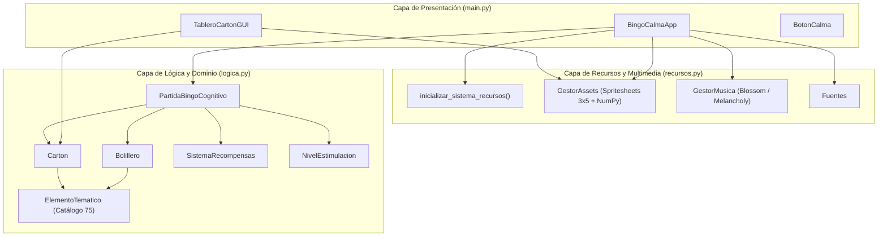

# Guía de Clases, Métodos y Arquitectura del Sistema
## Bingo Calma — Estimulación Cognitiva y Sensorial

Documento de referencia técnica que detalla la arquitectura modular en 3 capas, sus clases, métodos y responsabilidades.

---

## 1. Arquitectura en Tres Capas

---

## 2. Módulo de Lógica y Dominio (`logica.py`)

### 2.1. `ElementoTematico`
Representa cada una de las 75 fichas/balotas temáticas que sustituyen a los números tradicionales del bingo.

* **Atributos:**
  - `id`: Identificador numérico único (1 al 75).
  - `numero`: Alias del identificador numérico.
  - `nombre`: Nombre del concepto temático (ej: *"Café de olla"*, *"Rosa roja"*).
  - `categoria`: Una de las 5 categorías (*"Animales"*, *"Sabores"*, *"Objetos"*, *"Naturaleza"*, *"Música"*).
  - `letra`: Letra de la columna del bingo asignada según su ID (B, I, N, G u O).
  - `sacada`: Booleano que indica si ya ha sido extraída del bolillero.

* **Métodos:**
  - `_columna_letra(item_id)`: Clasifica el ID en su respectiva columna:
    - 1 a 15 $\rightarrow$ **B** (Animales)
    - 16 a 30 $\rightarrow$ **I** (Sabores)
    - 31 a 45 $\rightarrow$ **N** (Objetos)
    - 46 a 60 $\rightarrow$ **G** (Naturaleza)
    - 61 a 75 $\rightarrow$ **O** (Música)
  - `marcar_sacada()`: Establece `sacada = True`.
  - `reiniciar()`: Restaura `sacada = False`.

---

### 2.2. `CATALOGO_75_ITEMS` y `crear_catalogo_completo()`
- `CATALOGO_75_ITEMS`: Diccionario con la definición de los 75 elementos nostálgicos.
- `crear_catalogo_completo()`: Instancia y devuelve una copia con los 75 objetos `ElementoTematico`.

---

### 2.3. `Bolillero`
Controla el bombo virtual de extracción aleatoria sin repetición.

* **Atributos:**
  - `catalogo`: Referencia al catálogo de 75 elementos.
  - `bolas`: Lista de todos los elementos disponibles.
  - `bolas_disponibles`: Balotas aún no extraídas.
  - `historial_extraidas`: Lista ordenada de balotas extraídas durante la partida.
  - `ids_extraidos`: Conjunto (`set`) de IDs salidos para búsquedas inmediatas en $O(1)$.
  - `max_bolas_regular`: Límite máximo de extracciones regulares (40 balotas).

* **Métodos:**
  - `sacar_bola()`: Extrae una balota al azar de las disponibles, la marca y la añade al historial.
  - `total_extraidas`: Propiedad que devuelve la cantidad de balotas sacadas.
  - `quedan_bolas`: Propiedad booleana que verifica si restan balotas por extraer.
  - `fase_regular_completa`: Propiedad que indica si se alcanzó el límite de 40 extracciones.
  - `obtener_ultima_bola()`: Retorna el último elemento extraído.
  - `reiniciar()`: Restablece todas las balotas al bombo y limpia el historial.

---

### 2.4. `Carton`
Gestiona la matriz de $5 \times 5$ casillas de un cartón de bingo individual.

* **Atributos:**
  - `posicion_id`: Identificador del cartón (0 o 1).
  - `catalogo`: Referencia al catálogo temático.
  - `matriz_ids`: Matriz de $5 \times 5$ con los IDs de cada casilla (el centro `[2][2]` contiene valor `0`).
  - `marcados`: Matriz booleana de $5 \times 5$. La casilla central `[2][2]` se inicia siempre en `True`.
  - `modalidades_verificadas`: Diccionario que registra si cada una de las 14 figuras ya fue completada y premiada.

* **Métodos:**
  - `generar_carton()`: Genera aleatoriamente 5 elementos de cada columna sin repetición y asigna el centro libre.
  - `obtener_elemento_en(fila, col)`: Retorna el elemento correspondiente a la celda indicada.
  - `esta_marcado(fila, col)`: Retorna si la celda está marcada.
  - `marcar_manualmente(fila, col, ids_extraidos)`: Valida si la casilla clickeada corresponde a una balota ya extraída. Si es así, la cubre y otorga acierto.
  - `forma_1()` a `forma_13()`: Métodos algorítmicos que comprueban cada uno de los patrones geométricos.
  - `carton_lleno()`: Comprueba si las 24 casillas activas están cubiertas (Figura 14).
  - `existe_bingo()`: Evalúa todas las figuras pendientes de cobro y devuelve las completadas.
  - `validar_bingo(modalidades_permitidas)`: Filtra los bingos según las modalidades admitidas en el modo de juego activo.

---

### 2.5. `SistemaRecompensas`
Controla el puntaje de estimulación y estrellas de memoria.

* **Métodos:**
  - `ajustar_enfoque(delta)`: Modifica las fichas de enfoque de 5 a 50 puntos.
  - `registrar_acierto_destreza()`: Otorga 2 puntos por cada acierto manual al marcar la casilla correcta.
  - `acreditar_premio_figura(modalidad)`: Otorga las estrellas base multiplicadas por el factor de enfoque.
  - `reiniciar_sesion()`: Pone a cero los contadores de la sesión.

---

### 2.6. `NivelEstimulacion`
Define los modos de partida y sus figuras permitidas:
- `MODO_TRADICIONAL` (Modo 1): Líneas, cruz central, 4 faros y cartón lleno.
- `MODO_ESPECIAL` (Modo 2): Habilita las 14 figuras temáticas.
- `MODO_COMPLETO` (Modo 3): Orientado al Cartón Lleno.

---

### 2.7. `PartidaBingoCognitivo`
Controlador maestro de la sesión de juego.
- `iniciar_sorteo()`: Inicializa el estado de extracción regular.
- `extraer_siguiente_elemento()`: Extrae una nueva balota del bolillero.
- `marcar_casilla_por_usuario(carton_idx, fila, col)`: Procesa el clic del usuario, valida el acierto y detecta logros/bingos.

---

## 3. Módulo de Recursos (`recursos.py`)

### 3.1. `Fuentes`
Carga centralizada y parametrizada de tipografías TrueType y fuentes del sistema con diferentes tamaños y grosores (`titulo_inicio`, `celda_nombre`, `dialogo_tit`, etc.).

### 3.2. `GestorMusica`
Control de reproducción de audio ambiental con fundidos suaves (*fadeout*):
- `reproducir_menu()`: Bucle relajante `Blossom.ogg` a volumen balanceado.
- `reproducir_juego()`: Bucle tranquilo `melancholy.ogg` que estimula la concentración.

### 3.3. `GestorAssets`
- `limpiar_halo(surf, umbral)`: Filtro acelerado por **NumPy** (`pixels_alpha`) que elimina residuos y bordes oscuros en imágenes transparentes en milisegundos.
- `extraer_iconos_spritesheets(carpeta_bingo)`: Procesa los archivos `B.png`, `I.png`, `N.png`, `G.png`, `O.png` dividiendo cada cuadrícula de $3 \times 5$ para extraer los 75 iconos en alta resolución escalados a cajas uniformes.
- `cargar()`: Pre-renderiza todas las texturas de interfaz (fondos, tarjetas de partida, marcos de selección, tablero e iconos de encabezado).

### 3.4. `inicializar_sistema_recursos()`
Inicializa los subsistemas de Pygame (`init`, `font`, `mixer`), las fuentes y los assets en un único llamado.

---

## 4. Módulo de Presentación e Interfaz (`main.py`)

### 4.1. `BotonCalma`
Componente reutilizable de botón táctil/clic:
- `actualizar(mouse_pos)`: Detecta si el puntero se encuentra sobre el botón.
- `dibujar_hover(superficie)`: Genera un halo visual suave para retroalimentación táctil y sensorial.
- `es_clickeado(evento)`: Captura clics del botón izquierdo.

### 4.2. `TableroCartonGUI`
Dibuja el cartón interactivo de $474 \times 558$ píxeles:
- `dividir_texto_en_lineas(texto, fuente, max_ancho)`: Algoritmo de división de texto que distribuye palabras largas en dos líneas simétricas para evitar desbordes tipográficos.
- `obtener_celda_en_pos(mouse_pos)`: Mapea coordenadas del ratón a coordenadas matriciales `(fila, columna)`.
- `dibujar(superficie, mouse_pos, elemento_actual_id)`: Renderiza el fondo del cartón, los 24 recuadros, los iconos temáticos, los nombres legibles y las marcas de acierto.

### 4.3. `BingoCalmaApp`
Controlador principal de la ventana (1280x720):
- **Máquina de Estados**: `ESTADO_INICIO`, `ESTADO_SELECCION`, `ESTADO_JUEGO`.
- `_iniciar_partida(modo)`: Instancia la partida lógica y crea cartones aleatorios nuevos en cada juego.
- `_dibujar_pantalla_inicio()`: Menú principal con tarjetas estéticas e iluminación dinámica.
- `_dibujar_modal_como_jugar()`: Guía amigable de 4 pasos para los participantes.
- `_dibujar_pantalla_seleccion()`: Selector de las modalidades Corta, Media y Completa.
- `_dibujar_pantalla_juego()`: Mesa de juego con riel superior, balota destacada, indicadores de figuras, botón de pausa y modal de victoria.
- `ejecutar()`: Bucle principal a 60 cuadros por segundo.
